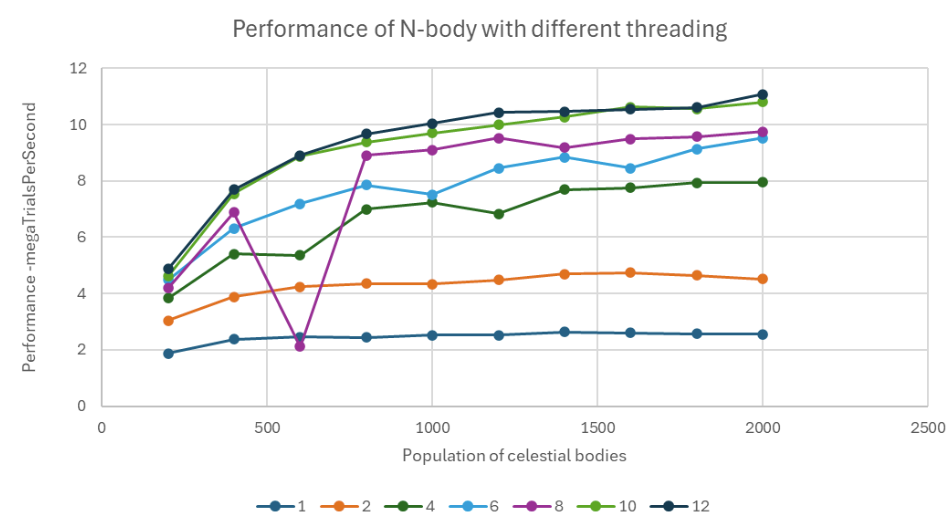
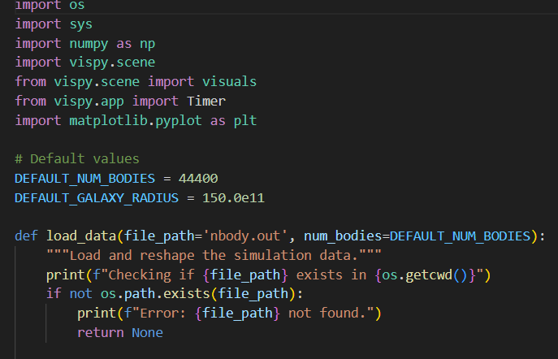

# N-body Simulation

.mp4)

## Overview

This project implements an N-body simulation using CUDA parallel programming and CPU hyperthreading to efficiently compute the gravitational interactions between a large number of bodies (e.g., stars, planets, black holes). The simulation leverages the massive parallel processing power of modern GPUs and the multitasking capabilities of CPUs to handle the computationally intensive calculations required by the N-body problem.

## The N-body Problem

The N-body problem involves predicting the individual motions of a group of celestial objects interacting with each other gravitationally. The challenge arises from the fact that every body exerts a force on every other body, leading to a complex system of differential equations that need to be solved to simulate the system's evolution over time.

In a direct N-body simulation, the force on each body is computed by summing the contributions from all other bodies. This requires `O(N^2)` calculations for each time step, making it computationally expensive as the number of bodies increases.

## CPU Hyperthreading and Parallelism

### Hyperthreading and Parallelism

The simulation also explores the use of CPU hyperthreading, where each physical core on the CPU is split into two logical cores. This allows for more threads to be run simultaneously, increasing the efficiency of parallel computations. However, parallelism performance is generally best with 10 to 12 cores, beyond which the gains may diminish due to overheads.



### Visualizing the Results

The simulation results are visualized using VisPy, providing a detailed view of the dynamic behavior of the system.

## Changing Parameters

### Modifying `build.bat`

You can customize the simulation by changing parameters such as the number of stars, black holes, radius, planets, and time directly in the `build.bat` file. Keep in mind that increasing the number of planets significantly impacts the computation time, as it grows quadratically with the number of bodies (`O(N^2)`) and linearly with the time steps (`O(N)`).


### Customizing the Visualizer

The `visualizer2.py` script is also customizable to handle larger pre-made files or tweak options. Two crucial parameters to consider are:

- **Number of Bodies**: This dictates how many bodies will be visualized.
- **Radius**: The radius determines the view box's size and orientation.

Adjusting these settings can significantly impact the visual output.



## Getting Started

### Prerequisites

- **CUDA Toolkit 11.7**: Make sure CUDA 11.7 is installed on your system.
- **Dependencies**:
  - **VisPy**: A high-performance visualization library for Python.
  - **Matplotlib**: For plotting and displaying graphs.
  - **NumPy**: For numerical operations in Python.
  - **C++ Libraries**: Including `iostream`, `vector`, `cmath`, `cstdlib`, `ctime`, `cstdio`, `fstream`, and `iomanip`.
  - **OpenMP**: For parallel programming on the CPU.
  - **CUDA Runtime**: For executing CUDA kernels on the GPU.

### Running the Simulation

Once all necessary files and dependencies are in place, you can run the simulation using the following command in your terminal:

```bash
./build.bat

